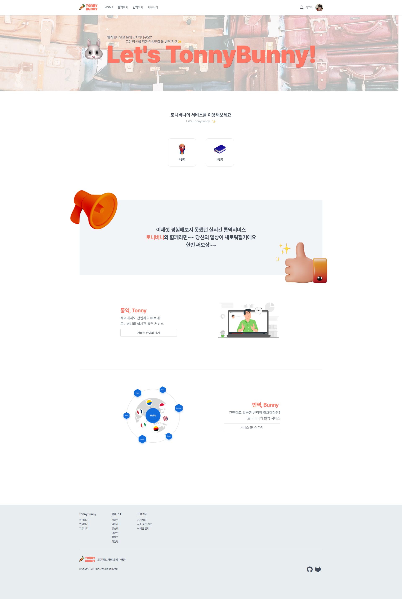
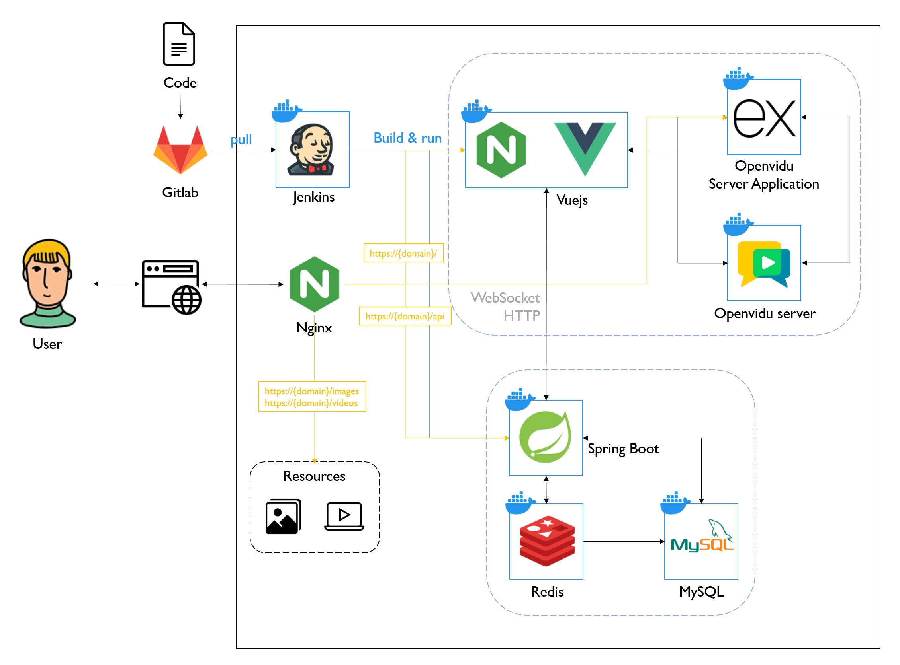
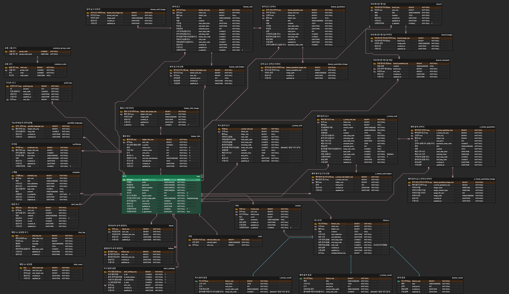

# 🐰TonnyBunny🐰

<div style="margin-left: 5px;" align="center">
SSAFY 8기 2학기 공통 프로젝트
<br/>
[✨우수 프로젝트 수상✨]
<div style="font-weight: bold; font-size: 1.2em;">2023.01.02 ~ 2023.02.17</div>
</div>

## 🥕 서비스 소개

코로나 19의 영향력이 점차 감소하면서 해외 여행의 수요가 늘어나고 있습니다. 언어가 다른 장소에서 급한 용건이나 중요한 업무들을 수행하고 싶지만, AI 통번역 서비스는 아직 오역 사례가 종종 나와서 의사가 제대로 전달되고 있는지 우려가 되곤 합니다.
<br><br>
TonnyBunny는 이러한 분들을 위해 통역사와 고객을 매칭하고, 화상통화로 통역사가 실시간 통역을 해주는 <span style="color: orange">**실시간 동시 통역 서비스**</span>를 제공합니다.
또한, 통역 뿐만 아니라 고객이 번역을 편리하게 의뢰할 수 있는 <span style="color: orange">**번역 요청 게시판**</span>을 제공합니다.
<br><br>
TonnyBunny는 서비스를 제공하는 통번역가 분들을 <span style="color: orange">**헬퍼**</span>라고 부르고 있습니다. 아래는 헬퍼와 고객을 위한 TonnyBunny 서비스를 설명하고 있습니다. **잘해5조**팀의 7주간의 여정을 재밌게 봐주세요🥕🥕
<br>

## 🥕 소개 영상 [↗ 영상 링크](https://www.youtube.com/watch?v=jPc9Sr7G4Tw)

<br>

## 🥕 주요 기능

### ✔️ 회원 가입

-   고객 또는 헬퍼 유형을 선택해서 가입합니다.

### ✔️ 로그인

### ✔️ 마이페이지

-   포인트 관리
    -   포인트 충전 및 조회, 이용 내역을 확인합니다.
-   헬퍼 프로필 관리
    -   통역, 번역 경력을 어필할 수 있는 자기 소개 페이지 등을 관리합니다.
-   이용 내역 조회
    -   고객의 경우 의뢰한 내역을, 헬퍼의 경우 맡은 업무의 내역을 조회합니다.
-   차단하기
    -   마음에 들지 않는 사용자를 차단할 수 있습니다.
-   즐겨찾기
    -   마음에 드는 헬퍼를 즐겨찾기할 수 있습니다.

### ✔️ 즉시 통역

-   대기 중인 통역사와 즉시 매칭하고 실시간으로 통역할 수 있는 서비스입니다.
-   고객이 즉시 통역 서비스를 요청하면 헬퍼가 실시간으로 요청을 확인하고, 요청 대기 신청을 합니다.
-   고객은 대기 신청한 헬퍼 중, 금액이나 스펙을 확인하고 마음에 드는 헬퍼를 수락합니다.
-   고객과 헬퍼는 화상 통화 화면으로 이동해서 실시간 통역을 수행합니다.

### ✔️ 예약 통역

-   고객이 통역 예약 일정과 업무에 대한 내용을 공고에 올리면, 헬퍼가 그것을 보고 신청합니다.
-   매칭이 성공하면 예약한 일정에 즉시 통역 서비스와 같이 실시간 통역을 수행합니다.

### ✔️ 번역가 매칭

-   고객이 번역 일정과 업무에 대한 내용을 공고에 올리면, 헬퍼가 그것을 보고 신청합니다.
-   고객은 헬퍼들이 신청한 목록을 보고, 헬퍼와 채팅으로 상담을 합니다.
-   헬퍼는 번역 업무에 대한 견적서를 작성해서 고객에게 제시합니다.
-   고객이 견적서가 마음에 들면 수락하고, 헬퍼에게 번역을 맡기게 됩니다.

### ✔️ 커뮤니티

-   간단한 번역을 부탁하거나 유저끼리 소통할 수 있는 게시판입니다.

### ✔️ 리뷰 작성

-   즉시 통역, 예약 통역, 번역 업무를 완수하고 나면 고객은 헬퍼에 대한 리뷰를 작성할 수 있습니다.
-   헬퍼의 서비스에 문제가 있는 경우, 고객은 헬퍼를 신고할 수 있습니다.

### ✔️ 채팅

-   번역가 매칭을 하기 전, 고객과 번역가는 실시간 채팅을 통해 서로의 요구 사항을 조율하고 상담할 수 있습니다.

### ✔️ 실시간 알림

-   통번역 서비스 진행 중 발생하는 매칭 요청들이나 채팅 알림을 실시간으로 확인할 수 있습니다.

## 🥕 기능 명세서

<details>
<summary><b>기능 명세서</b></summary>
<div>

| 화면                                               | 세부페이지                   | epic               | 기능                              | 플랫폼    | 설명                                                                                                                                              |
| -------------------------------------------------- | ---------------------------- | ------------------ | --------------------------------- | --------- | ------------------------------------------------------------------------------------------------------------------------------------------------- |
| 회원가입 페이지                                    | 회원가입                     | 회원가입           | 일반 유저 가입                    | PC,모바일 | 일반 유저 가입 화면으로 이동                                                                                                                      |
| 회원가입 페이지                                    | 회원가입                     | 페이지 이동        | 헬퍼 유저 가입                    | PC,모바일 | 헬퍼 유저 가입 화면으로 이동                                                                                                                      |
| 회원가입 페이지                                    | 회원가입                     | 회원가입           | 약관 동의                         | PC,모바일 | 약관 비동의 시 회원가입 진행 불가                                                                                                                 |
| 회원가입 페이지                                    | 회원가입                     | 회원가입           | 비밀번호 유효성 검사              | PC,모바일 | 유효성 검사 실패 시 [문구] 출력 유효성 검사 실패 시 회원가입 진행 불가                                                                            |
| 회원가입 페이지                                    | 회원가입                     | 회원가입           | 비밀번호 확인 유효성 검사         | PC,모바일 | 비밀번호와 다를 경우 [문구] 출력 비밀번호와 다를 경우 회원가입 진행 불가                                                                          |
| 회원가입 페이지                                    | 회원가입                     | 회원가입           | 이메일 유효성 검사                | PC,모바일 | 이메일 형식과 다를 경우 [문구] 출력 이메일 형식과 다를 경우 회원가입 진행 불가                                                                    |
| 회원가입 페이지                                    | 회원가입                     | 회원가입           | 비밀번호 암호화                   | PC,모바일 | 스프링 시큐리티를 통한 암호화                                                                                                                     |
| 회원가입 페이지                                    | 회원가입                     | 회원가입           | 닉네임 중복 확인                  | PC,모바일 | 닉네임 중복 시 [문구] 출력 닉네임 중복 시 회원가입 진행 불가                                                                                      |
| 회원가입 페이지                                    | 회원가입                     | 회원가입           | 휴대폰 본인 인증                  | PC,모바일 | 1. 인증 번호를 발송하여 시간 내 입력 2. 기존의 시스템 사용 휴대폰 미인증 시 회원가입 진행 불가                                                    |
| 로그인 페이지                                      | 로그인                       | 페이지 이동        | 회원가입 페이지                   | PC,모바일 | 회원가입 화면으로 이동                                                                                                                            |
| 로그인 페이지                                      | 로그인                       | 회원가입           | 로그인                            | PC,모바일 | 아이디와 비밀번호 미입력 시 [문구] 출력 아이디와 비밀번호 오류 시 [문구] 출력                                                                     |
| 로그인 페이지                                      | 로그인                       | 회원가입           | JWT 토큰                          | PC,모바일 | Access Token과 Refresh Token을 사용하여 로그인 여부 확인 및 갱신                                                                                  |
| 로그인 페이지                                      | 로그인                       | 페이지 이동        | 아이디 찾기                       | PC,모바일 | 아이디 찾기 화면으로 이동                                                                                                                         |
| 로그인 페이지                                      | 로그인                       | 페이지 이동        | 비밀번호 찾기                     | PC,모바일 | 비밀번호 찾기 화면으로 이동                                                                                                                       |
| 메인 페이지                                        | 내비게이션                   | 페이지 이동        | 홈                                | PC,모바일 | 메인 화면으로 이동                                                                                                                                |
| 메인 페이지                                        | 내비게이션                   | 페이지 이동        | 커뮤니티                          | PC,모바일 | 커뮤니티 화면으로 이동                                                                                                                            |
| 메인 페이지                                        | 내비게이션                   | 페이지 이동        | 1:1 상담                          | PC,모바일 | 1:1 상담 화면으로 이동                                                                                                                            |
| 메인 페이지                                        | 내비게이션                   | 페이지 이동        | 알림                              | PC,모바일 | 알림 화면으로 이동                                                                                                                                |
| 메인 페이지                                        | 내비게이션                   | 페이지 이동        | 마이페이지                        | PC,모바일 | 마이페이지 화면으로 이동                                                                                                                          |
| 마이 페이지                                        | 마이페이지                   | 페이지 이동        | 회원정보 수정                     | PC,모바일 | 회원정보 수정 화면으로 이동                                                                                                                       |
| 마이 페이지                                        | 마이페이지                   | 페이지 이동        | 즐겨찾기 목록                     | PC,모바일 | 즐겨찾기 목록 페이지로 이동                                                                                                                       |
| 마이 페이지                                        | 마이페이지                   | 페이지 이동        | 차단 목록                         | PC,모바일 | 차단 목록 페이지로 이동                                                                                                                           |
| 마이 페이지                                        | 마이페이지                   | 페이지 이동        | 히스토리                          | PC,모바일 | 히스토리 화면으로 이동                                                                                                                            |
| 마이 페이지                                        | 마이페이지                   | 페이지 이동        | 헬퍼 등록하기                     | PC,모바일 | 헬퍼 등록하기 화면으로 이동                                                                                                                       |
| 마이 페이지                                        | 마이페이지                   | 페이지 이동        | 헬퍼 정보 관리                    | PC,모바일 | 헬퍼 정보 관리 화면으로 이동                                                                                                                      |
| 마이 페이지                                        | 마이페이지                   | 페이지 이동        | 설정                              | PC,모바일 | 설정 화면으로 이동                                                                                                                                |
| 마이 페이지                                        | 마이페이지                   | 페이지 이동        | 고객센터                          | PC,모바일 | 고객센터 화면으로 이동                                                                                                                            |
| 마이 페이지                                        | 마이페이지                   | 페이지 이동        | 일정관리                          | PC,모바일 | 일정관리 화면으로 이동                                                                                                                            |
| 마이 페이지                                        | 마이페이지                   | 회원가입           | 로그아웃                          | PC,모바일 |                                                                                                                                                   |
| 마이 페이지                                        | 마이페이지                   | 회원정보 수정      | 회원탈퇴                          | PC,모바일 | 약관 비동의 시 회원탈퇴 진행 불가                                                                                                                 |
| 마이 페이지                                        | 회원정보 수정                | 조회               | 유저 정보 조회                    | PC,모바일 | 로그인 한 유저 정보 조회                                                                                                                          |
| 마이 페이지                                        | 회원정보 수정                | 회원정보 수정      | 프로필 사진 변경                  | PC,모바일 | 이미지 파일 업로드 후 등록 [기본 이미지로 변경] 시 이미지 제거                                                                                    |
| 마이 페이지                                        | 회원정보 수정                | 회원정보 수정      | 닉네임 변경                       | PC,모바일 | 닉네임 중복 시 [문구] 출력 닉네임 중복 시 회원정보 수정 불가                                                                                      |
| 마이 페이지                                        | 회원정보 수정                | 회원정보 수정      | 비밀번호 변경                     | PC,모바일 | 유효성 검사 실패시 [문구] 출력 유효성 검사 실패시 회원정보 수정 불가                                                                              |
| 마이 페이지                                        | 즐겨찾기 목록                | 조회               | 즐겨찾기 목록 조회                | PC,모바일 | 로그인 한 유저의 즐겨찾기 목록 조회                                                                                                               |
| 마이 페이지                                        | 즐겨찾기 목록                | 회원정보 수정      | 즐겨찾기 추가                     | PC,모바일 | 선택된 유저를 로그인 한 유저의 즐겨찾기 목록에 추가                                                                                               |
| 마이 페이지                                        | 즐겨찾기 목록                | 회원정보 수정      | 즐겨찾기 삭제                     | PC,모바일 | 선택된 유저를 로그인 한 유저의 즐겨찾기 목록에서 삭제                                                                                             |
| 마이 페이지                                        | 히스토리                     | 조회               | 히스토리 목록 조회                | PC,모바일 | 로그인 한 유저의 히스토리 목록 조회                                                                                                               |
| 마이 페이지                                        | 히스토리                     | 조회               | 히스토리 조회                     | PC,모바일 | 선택된 히스토리 조회                                                                                                                              |
| 마이 페이지                                        | 히스토리                     | 조회               | 히스토리 목록 정렬                | PC,모바일 | 로그인 한 유저의 히스토리 목록 정렬                                                                                                               |
| 마이 페이지                                        | 히스토리                     | 회원정보 수정      | 유저 신고                         | PC,모바일 |                                                                                                                                                   |
| 마이 페이지                                        | 차단 목록                    | 조회               | 차단 목록 조회                    | PC,모바일 | 로그인 한 유저의 차단 목록 조회                                                                                                                   |
| 마이 페이지                                        | 차단 목록                    | 회원정보 수정      | 유저 차단                         | PC,모바일 | 선택된 유저를 로그인 한 유저의 차단 목록에 추가                                                                                                   |
| 마이 페이지                                        | 차단 목록                    | 회원정보 수정      | 유저 차단 해제                    | PC,모바일 | 선택된 유저를 로그인 한 유저의 차단 목록에서 삭제                                                                                                 |
| 마이 페이지                                        | 헬퍼 정보 관리               | 조회               | 어학 정보 목록 조회               | PC,모바일 | 로그인 한 유저의 어학 정보 목록 조회                                                                                                              |
| 마이 페이지                                        | 헬퍼 정보 관리               | 조회               | 가능 언어 목록 조회               | PC,모바일 | 로그인 한 유저의 가능 언어 목록 조회                                                                                                              |
| 마이 페이지                                        | 헬퍼 정보 관리               | 회원정보 수정      | 어학 정보 등록                    | PC,모바일 | 로그인 한 유저의 어학 정보를 추가                                                                                                                 |
| 마이 페이지                                        | 헬퍼 정보 관리               | 회원정보 수정      | 가능 언어 정보 등록               | PC,모바일 | 로그인 한 유저의 가능 언어 정보를 추가                                                                                                            |
| 마이 페이지                                        | 헬퍼 정보 관리               | 회원정보 수정      | 한 줄 자기 소개 등록              | PC,모바일 | 로그인 한 유저의 한 줄 자기소개를 추가                                                                                                            |
| 마이 페이지                                        | 헬퍼 정보 관리               | 회원정보 수정      | 헬퍼 자기 소개 등록               | PC,모바일 | 로그인 한 유저의 자기소개를 추가                                                                                                                  |
| 마이 페이지                                        | 헬퍼 정보 관리               | 회원정보 수정      | 어학 정보 삭제                    | PC,모바일 | 로그인 한 유저의 어학 정보를 삭제                                                                                                                 |
| 마이 페이지                                        | 헬퍼 정보 관리               | 회원정보 수정      | 가능 언어 정보 삭제               | PC,모바일 | 로그인 한 유저의 가능 언어 정보를 삭제                                                                                                            |
| 마이 페이지                                        | 헬퍼 정보 관리               | 회원정보 수정      | 헬퍼 지표 수정 완료               | PC,모바일 | 로그인 한 유저의 헬퍼 정보 수정을 완료                                                                                                            |
| 마이 페이지                                        | 설정                         | 조회               | 푸시 알림 설정 조회               | PC,모바일 | 로그인 한 유저의 푸시 알림 설정을 조회                                                                                                            |
| 마이 페이지                                        | 설정                         | 회원정보 수정      | 푸시 알림 설정 수정               | PC,모바일 | 로그인 한 유저의 푸시 알림 설정을 변경                                                                                                            |
| 마이 페이지                                        | 포인트 관리 페이지           | 조회               | 보유 포인트 조회                  | PC,모바일 | 로그인 한 유저의 포인트 정보를 조회                                                                                                               |
| 마이 페이지                                        | 포인트 관리 페이지           | 조회               | 포인트 사용 내역 조회             | PC,모바일 | 로그인 한 유저의 포인트 사용 내역을 조회                                                                                                          |
| 마이 페이지                                        | 포인트 관리 페이지           | 회원정보 수정      | 포인트 충전                       | PC,모바일 | 로그인 한 유저의 보유 포인트를 충전                                                                                                               |
| 마이 페이지                                        | 포인트 관리 페이지           | 회원정보 수정      | 포인트 환전                       | PC,모바일 | 로그인 한 유저의 보유 포인트를 환전                                                                                                               |
| 마이 페이지                                        | 고객 센터                    | 페이지 이동        | 공지사항                          | PC,모바일 | 공지사항 화면으로 이동                                                                                                                            |
| 마이 페이지                                        | 고객 센터                    | 조회               | 공지사항 목록 조회                | PC,모바일 |                                                                                                                                                   |
| 마이 페이지                                        | 고객 센터                    | 기타               | 이메일 주소 복사                  | PC,모바일 |                                                                                                                                                   |
| 마이 페이지                                        | 고객 센터                    | 기타               | 고객센터 전화                     | 모바일    |                                                                                                                                                   |
| 메인 페이지                                        | 통역 페이지                  | 페이지 이동        | 통역 페이지                       | PC,모바일 | 통역 화면으로 이동                                                                                                                                |
| 메인 페이지                                        | 통역 페이지                  | 페이지 이동        | 번역 페이지                       | PC,모바일 | 번역 화면으로 이동                                                                                                                                |
| 메인 페이지                                        | 통역 페이지                  | 페이지 이동        | 즉시통역                          | PC,모바일 | 즉시통역 화면으로 이동                                                                                                                            |
| 메인 페이지                                        | 통역 페이지                  | 페이지 이동        | 예약통역                          | PC,모바일 | 예약통역 화면으로 이동                                                                                                                            |
| 메인 페이지                                        | 통역 페이지                  | 페이지 이동        | 헬퍼 페이지                       | PC,모바일 | 헬퍼 페이지 화면으로 이동                                                                                                                         |
| 즉시 통역 페이지                                   | 즉시 통역 매칭 페이지 (고객) | 통역 매칭          | 필요 언어 설정                    | PC,모바일 | 고객이 통역을 필요로 하는 언어 설정                                                                                                               |
| 즉시 통역 페이지                                   | 즉시 통역 매칭 페이지 (고객) | 통역 매칭          | 예상 소요 시간 설정               | PC,모바일 | 고객이 예상하는 통역 시간                                                                                                                         |
| 즉시 통역 페이지                                   | 즉시 통역 매칭 페이지 (고객) | 통역 매칭          | 상황 설명                         | PC,모바일 | 고객이 처한 상황에 대한 설명                                                                                                                      |
| 즉시 통역 페이지                                   | 즉시 통역 매칭 페이지 (고객) | 통역 매칭          | 상황 카테고리                     | PC,모바일 | 고객이 처한 상황에 해당하는 카테고리                                                                                                              |
| 즉시 통역 페이지                                   | 즉시 통역 매칭 페이지 (고객) | 통역 매칭          | 실시간 통역 매칭 요청             | PC,모바일 | 고객의 가능언어와 필요 언어가 모두 가능한 헬퍼에게 고객이 입력한 정보를 전송                                                                      |
| 즉시 통역 페이지                                   | 즉시 통역 매칭 페이지 (고객) | 통역 매칭          | 실시간 통역 매칭 요청 취소        | PC,모바일 |                                                                                                                                                   |
| 즉시 통역 페이지                                   | 즉시 통역 매칭 페이지 (고객) | 통역 매칭          | 실시간 통역 매칭 신청 헬퍼 목록   | PC,모바일 | 실시간 통역을 희망하는 헬퍼를 고객의 헬퍼리스트에 출력                                                                                            |
| 즉시 통역 페이지                                   | 즉시 통역 매칭 페이지 (고객) | 통역 매칭          | 실시간 통역 매칭 신청 헬퍼 거절   | PC,모바일 |                                                                                                                                                   |
| 즉시 통역 페이지                                   | 즉시 통역 매칭 페이지 (고객) | 통역 매칭          | 실시간 통역 매칭 신청 헬퍼 수락   | PC,모바일 | 선택한 헬퍼와 화상 통화 연결                                                                                                                      |
| 즉시 통역 페이지                                   | 즉시 통역 매칭 페이지 (고객) | 통역 매칭          | 실시간 통역 매칭 연결 실패 - 고객 | PC,모바일 |                                                                                                                                                   |
| 즉시 통역 페이지                                   | 즉시 통역 매칭 페이지 (헬퍼) | 통역 매칭          | 콜 ON                             | PC        | 고객이 전송하는 실시간 통역 매칭 신청을 받을 수 있는 상태로 변경                                                                                  |
| 즉시 통역 페이지                                   | 즉시 통역 매칭 페이지 (헬퍼) | 통역 매칭          | 콜 OFF                            | PC        |                                                                                                                                                   |
| 즉시 통역 페이지                                   | 즉시 통역 매칭 페이지 (헬퍼) | 회원정보 수정      | 단가 수정                         | PC,모바일 | 로그인 된 유저의 단가 정보를 수정                                                                                                                 |
| 즉시 통역 페이지                                   | 즉시 통역 매칭 페이지 (헬퍼) | 통역 매칭          | 실시간 통역 매칭 요청 리스트      | PC        | 헬퍼에게 전송된 고객의 매칭 요청 목록                                                                                                             |
| 즉시 통역 페이지                                   | 즉시 통역 매칭 페이지 (헬퍼) | 통역 매칭          | 실시간 통역 매칭 요청 조회        | PC        | 헬퍼에게 전송된 고객의 매칭 요청                                                                                                                  |
| 즉시 통역 페이지                                   | 즉시 통역 매칭 페이지 (헬퍼) | 통역 매칭          | 실시간 통역 매칭 신청             | PC        | 헬퍼에게 전송된 고객의 매칭 요청 응답                                                                                                             |
| 즉시 통역 페이지                                   | 즉시 통역 매칭 페이지 (헬퍼) | 통역 매칭          | 실시간 통역 매칭 신청 취소        | PC        |                                                                                                                                                   |
| 즉시 통역 페이지                                   | 즉시 통역 매칭 페이지 (헬퍼) | 통역 매칭          | 실시간 통역 매칭 연결 실패 - 헬퍼 | PC        |                                                                                                                                                   |
| 즉시 통역 페이지                                   | 즉시 통역 매칭 페이지 (헬퍼) | 통역 매칭          | 실시간 통역 매칭 연결 성공        | PC        | 선택한 고객과 화상 통화 연결                                                                                                                      |
| 즉시 통역 페이지                                   | 화상 채팅 페이지             | On-Air             | 화상 통화                         | PC,모바일 | WebRTC 를 이용한 화상통화 기능                                                                                                                    |
| 즉시 통역 페이지                                   | 화상 채팅 페이지             | On-Air             | 음성 통화                         | PC,모바일 | WebRTC 를 이용한 음성통화 기능                                                                                                                    |
| 즉시 통역 페이지                                   | 화상 채팅 페이지             | On-Air             | 1:1 채팅                          | PC,모바일 | WebRTC 를 이용한 1:1 채팅 기능                                                                                                                    |
| 즉시 통역 페이지                                   | 화상 채팅 페이지             | On-Air             | 음량 조절                         | PC,모바일 | 통화 상대의 음량을 조절                                                                                                                           |
| 즉시 통역 페이지                                   | 화상 채팅 페이지             | On-Air             | 카메라 변경                       | PC,모바일 | 접속중인 기기의 카메라를 변경                                                                                                                     |
| 즉시 통역 페이지                                   | 화상 채팅 페이지             | On-Air             | 카메라 ON/OFF                     | PC,모바일 | 화상 통화 환경의 카메라 조절                                                                                                                      |
| 즉시 통역 페이지                                   | 화상 채팅 페이지             | On-Air             | 마이크 ON/OFF                     | PC,모바일 | 화상 통화 환경의 마이크 조절                                                                                                                      |
| 즉시 통역 페이지                                   | 화상 채팅 페이지             | On-Air             | 통화 시간 측정                    | PC,모바일 | 화상 통화가 시작된 이후의 경과 시간                                                                                                               |
| 즉시 통역 페이지                                   | 화상 채팅 페이지             | On-Air             | 통역 비용 계산                    | PC,모바일 |                                                                                                                                                   |
| 예약 통역 페이지                                   | 화상 채팅 페이지             | On-Air             | 통화 종료 제안                    | PC        | 헬퍼가 고객에게 통화 종료를 제안                                                                                                                  |
| 즉시 통역 페이지                                   | 화상 채팅 페이지             | On-Air             | 통화 종료                         | PC,모바일 |                                                                                                                                                   |
| 즉시 통역 페이지,예약 통역 페이지,번역 요청 페이지 | 서비스 종료 페이지           | 기타               | 리뷰 폼 출력                      | PC,모바일 |                                                                                                                                                   |
| 즉시 통역 페이지,예약 통역 페이지,번역 요청 페이지 | 서비스 종료 페이지           | 기타               | 신고 폼 출력                      | PC,모바일 | 신고하기 버튼을 통한 신고 페이지 이동                                                                                                             |
| 즉시 통역 페이지,예약 통역 페이지,번역 요청 페이지 | 서비스 종료 페이지           | 기타               | 리뷰 작성                         | PC,모바일 | 고객이 작성한 리뷰를 헬퍼의 리뷰리스트에 추가                                                                                                     |
| 즉시 통역 페이지,예약 통역 페이지,번역 요청 페이지 | 서비스 종료 페이지           | 기타               | 리뷰 수정                         | PC,모바일 | 고객이 작성한 리뷰를 헬퍼의 리뷰리스트에 추가                                                                                                     |
| 예약 통역 페이지                                   | 예약 통역 매칭 페이지 (고객) | 조회               | 예약 통역 매칭 요청 조회          | PC,모바일 | 자신이 전송한 예약 통역 매칭 요청 조회                                                                                                            |
| 예약 통역 페이지                                   | 예약 통역 매칭 페이지 (고객) | 조회               | 예약 통역 매칭 조회 - 고객        | PC,모바일 |                                                                                                                                                   |
| 예약 통역 페이지                                   | 예약 통역 매칭 페이지 (고객) | 예약 통역          | 예약 통역 입장                    | PC,모바일 | 예약 통역 매칭에 성공한 상대와의 화상 통화 연결                                                                                                   |
| 예약 통역 페이지                                   | 예약 통역 매칭 페이지 (고객) | 예약 통역          | 예약 통역 공고 생성               | PC,모바일 |                                                                                                                                                   |
| 예약 통역 페이지                                   | 예약 통역 매칭 페이지 (고객) | 예약 통역          | 예약 통역 매칭 신청 수락          | PC,모바일 |                                                                                                                                                   |
| 예약 통역 페이지                                   | 예약 통역 매칭 페이지 (고객) | 예약 통역          | 예약 통역 매칭 신청 거절          | PC,모바일 |                                                                                                                                                   |
| 예약 통역 페이지                                   | 예약 통역 매칭 페이지 (헬퍼) | 조회               | 예약 통역 공고 목록 조회          | PC,모바일 | 조건에 맞는 예약 통역 공고 목록 조회                                                                                                              |
| 예약 통역 페이지                                   | 예약 통역 매칭 페이지 (헬퍼) | 조회               | 예약 통역 공고 조회               | PC,모바일 | 선택된 예약 통역 공고 조회                                                                                                                        |
| 예약 통역 페이지                                   | 예약 통역 매칭 페이지 (헬퍼) | 예약 통역          | 예약 통역 매칭 신청               | PC,모바일 | 선택한 공고의 작성자에게 예약 통역 매칭 신청                                                                                                      |
| 예약 통역 페이지                                   | 예약 통역 매칭 페이지 (헬퍼) | 알림관리           | 예약 통역 매칭 신청 알림          | PC,모바일 |                                                                                                                                                   |
| 예약 통역 페이지                                   | 예약 통역 매칭 페이지 (헬퍼) | 예약 통역          | 예약 통역 매칭 신청 취소          | PC,모바일 |                                                                                                                                                   |
| 예약 통역 페이지                                   | 예약 통역 매칭 페이지 (헬퍼) | 조회               | 예약 통역 매칭 조회 - 헬퍼        | PC,모바일 |                                                                                                                                                   |
| 예약 통역 페이지                                   | 예약 통역 매칭 페이지 (헬퍼) | 예약 통역          | 예약 통역 입장                    | PC,모바일 | 예약 통역 매칭에 성공한 상대와의 화상 통화 연결                                                                                                   |
| 메인 페이지                                        | 번역 페이지                  | 조회               | 실시간 번역 요청 목록 조회        | PC,모바일 | 실시간 번역 요청 목록을 조회                                                                                                                      |
| 메인 페이지                                        | 번역 페이지                  | 페이지 이동        | 번역 요청하기                     | PC,모바일 | 번역 요청 화면으로 이동                                                                                                                           |
| 메인 페이지                                        | 번역 페이지                  | 페이지 이동        | 번역 요청 확인하기                | PC,모바일 | 선택된 번역 요청의 세부 화면으로 이동                                                                                                             |
| 메인 페이지                                        | 번역 페이지                  | 조회               | 번역 요청 조회                    | PC,모바일 | 선택된 번역 요청을 조회                                                                                                                           |
| 메인 페이지                                        | 번역 페이지                  | 페이지 이동        | 번역 요청 전체 목록 보기          | PC,모바일 | 실시간 번역 요청 전체 목록 페이지로 이동                                                                                                          |
| 메인 페이지                                        | 번역 페이지                  | 조회               | 실시간 번역 요청 목록 필터링      | PC,모바일 |                                                                                                                                                   |
| 메인 페이지                                        | 번역 페이지                  | 페이지 이동        | 번역 카테고리                     | PC,모바일 | 특정 카테고리의 실시간 번역 요청 목록                                                                                                             |
| 메인 페이지                                        | 번역 페이지                  | 검색               | 번역 요청 검색                    | PC,모바일 | 키워드와 일치하는 실시간 번역 요청 목록 반환                                                                                                      |
| 메인 페이지                                        | 번역 페이지                  | 조회               | 번역 요청 검색 키워드 필터링      | PC,모바일 |                                                                                                                                                   |
| 번역 요청 페이지                                   | 번역 요청 페이지 (고객)      | 번역 요청          | 번역 요청 카테고리 설정           | PC,모바일 |                                                                                                                                                   |
| 번역 요청 페이지                                   | 번역 요청 페이지 (고객)      | 번역 요청          | 번역 요청 태그 설정               | PC,모바일 |                                                                                                                                                   |
| 번역 요청 페이지                                   | 번역 요청 페이지 (고객)      | 번역 요청          | 번역 요청 생성                    | PC,모바일 | 입력된 정보를 가지는 번역 요청 생성                                                                                                               |
| 번역 요청 페이지                                   | 번역 요청 페이지 (고객)      | 번역 요청          | 번역 요청 등록                    | PC,모바일 |                                                                                                                                                   |
| 번역 요청 페이지                                   | 번역 요청 페이지 (고객)      | 조회               | 번역 신청 목록 조회               | PC,모바일 | 선택된 번역 요청에 대해 번역을 신청한 헬퍼 목록 조회                                                                                              |
| 번역 요청 페이지                                   | 번역 요청 페이지 (고객)      | 번역 요청          | 번역 신청 수락                    | PC,모바일 |                                                                                                                                                   |
| 번역 요청 페이지                                   | 번역 요청 페이지 (고객)      | 번역 요청          | 번역 신청 거절                    | PC,모바일 |                                                                                                                                                   |
| 번역 요청 페이지                                   | 번역 요청 페이지 (고객)      | 번역 요청          | 번역 완료                         | PC,모바일 |                                                                                                                                                   |
| 번역 요청 페이지                                   | 번역 요청 페이지 (헬퍼)      | 번역 요청          | 번역 신청                         | PC,모바일 |                                                                                                                                                   |
| 번역 요청 페이지                                   | 번역 구인 페이지 (고객)      | 번역 요청          | 견적 요청서 생성                  | PC,모바일 | 입력된 정보를 가지는 견적 생성                                                                                                                    |
| 번역 요청 페이지                                   | 번역 구인 페이지 (고객)      | 번역 요청          | 견적 요청                         | PC,모바일 |                                                                                                                                                   |
| 번역 요청 페이지                                   | 번역 구인 페이지 (고객)      | 번역 요청          | 견적 확정하기                     | PC,모바일 |                                                                                                                                                   |
| 번역 요청 페이지                                   | 번역 구인 페이지 (헬퍼)      | 조회               | 견적 요청 목록 조회               | PC,모바일 | 본인에게 요청된 견적요청서 목록 조회                                                                                                              |
| 번역 요청 페이지                                   | 번역 구인 페이지 (헬퍼)      | 조회               | 견적 요청 조회                    | PC,모바일 | 본인에게 요청된 견적요청서 조회                                                                                                                   |
| 번역 요청 페이지                                   | 번역 구인 페이지 (헬퍼)      | 번역 요청          | 견적서 전송                       | PC,모바일 |                                                                                                                                                   |
| 채팅 페이지                                        | 1:1 상담 페이지              | 기타               | 1:1 채팅 발신                     | PC,모바일 | 특정 대상에게 메세지를 보냄                                                                                                                       |
| 채팅 페이지                                        | 1:1 상담 페이지              | 기타               | 1:1 채팅 수신                     | PC,모바일 | 특정 대상의 메세지를 받음                                                                                                                         |
| 채팅 페이지                                        | 1:1 상담 페이지              | 조회               | 1:1 채팅 내역 조회                | PC,모바일 | 특정 대상의 대화 내역 조회                                                                                                                        |
| 채팅 페이지                                        | 알림 페이지                  | 알림관리           | 알림                              | PC,모바일 | 특정 이벤트에 대해 발생한 알림 조회                                                                                                               |
| 채팅 페이지                                        | 알림 페이지                  | 알림관리           | 통역콜 알림                       | PC,모바일 | 통역콜 이벤트에 대해 발생한 알림 조회                                                                                                             |
| 마이 페이지                                        | 일정 관리 페이지             | 일정 관리          | 오늘 일정 조회                    | PC,모바일 |                                                                                                                                                   |
| 마이 페이지                                        | 일정 관리 페이지             | 일정 관리          | 이번주 일정 조회                  | PC,모바일 |                                                                                                                                                   |
| 마이 페이지                                        | 일정 관리 페이지             | 일정 관리          | 일정 생성                         | PC,모바일 | 입력된 정보를 가지는 일정 생성                                                                                                                    |
| 마이 페이지                                        | 일정 관리 페이지             | 일정 관리          | 일정 등록                         | PC,모바일 | 일정을 달력에 표시                                                                                                                                |
| 자유게시판                                         | 게시글 조회 페이지           | 게시판 게시글 조회 | 게시글 명 검색                    | PC,모바일 | - 검색창에 게시글명을 입력 후, “검색” 버튼을 클릭 [검색] - 검색어가 포함된 게시글 목록을 조회                                                     |
| 자유게시판                                         | 게시글 조회 페이지           | 게시판 게시글 조회 | 게시글 조회                       | PC,모바일 | [게시글] - 썸네일 - 제목 - 언어 - 게시글 날짜 - 간단 설명                                                                                         |
| 자유게시판                                         | 게시글 조회 페이지           | 게시판 게시글 조회 | 페이지네이션                      | PC,모바일 | - 한 화면에 게시글 10개 - 페이지네이션 적용                                                                                                       |
| 자유게시판                                         | 게시글 조회 페이지           | 페이지 이동        | 게시글 생성하기                   | PC,모바일 |                                                                                                                                                   |
| 자유게시판                                         | 게시글 상세 조회 페이지      | 게시글 상세        | 게시글 상세 조회                  | PC,모바일 | [게시글] - 게시글 제목 - 게시글 작성 날짜 - 번역 요청 언어 - 작성자 프로필 사진 - 작성자 닉네임 - 썸네일 - 게시글 내용 [기능] - 댓글창 열기 버튼  |
| 자유게시판                                         | 게시글 상세 조회 페이지      | 게시글 상세        | 게시글 삭제                       | PC,모바일 | - `⁝` 을 누르면 설정 모달이 뜸 → 삭제 버튼을 눌러서 게시글 삭제                                                                                   |
| 자유게시판                                         | 게시글 상세 조회 페이지      | 페이지 이동        | 게시글 수정                       | PC,모바일 | - `⁝` 을 누르면 설정 모달이 뜸 → 수정 버튼을 눌러서 게시글 수정 페이지로 이동                                                                     |
| 자유게시판                                         | 게시글 상세 조회 페이지      | 게시글 댓글        | 댓글 생성                         | PC,모바일 | - 댓글 내용을 입력해서 “확인” 버튼을 누름 - 댓글은 최대 1자 이상 쓰여져야 한다. - 만약 쓰여지지 않으면 “확인”버튼이 비활성화된다.                 |
| 자유게시판                                         | 게시글 상세 조회 페이지      | 게시글 댓글        | 댓글 수정                         | PC,모바일 | - `⁝` 을 누르면 설정 모달이 뜸 → “수정” 버튼을 누름                                                                                               |
| 자유게시판                                         | 게시글 상세 조회 페이지      | 게시글 댓글        | 댓글 삭제                         | PC,모바일 | - `⁝` 을 누르면 설정 모달이 뜸 → “삭제”버튼을 누름                                                                                                |
| 자유게시판                                         | 게시글 상세 조회 페이지      | 게시글 댓글        | 댓글 조회                         | PC,모바일 | [댓글] - 작성자 프로필 사진 - 작성자 닉네임 - 작성 날짜 - 댓글 내용                                                                               |
| 자유게시판                                         | 게시글 생성 페이지           | 게시글 생성        | 게시글 사진 추가                  | PC,모바일 | - 사진을 업로드한다.                                                                                                                              |
| 자유게시판                                         | 게시글 생성 페이지           | 게시글 생성        | 게시글 사진 삭제                  | PC,모바일 | - 추가한 사진을 삭제한다. - 사진에 있는 “x” 아이콘을 클릭해서 삭제한다.                                                                           |
| 자유게시판                                         | 게시글 생성 페이지           | 게시글 생성        | 게시글 제목 작성                  | PC,모바일 | - 최소 1자 이상 최대 200자로 제한한다. - 만약 작성되지 않거나, 최대 글자 수 가 넘어가면 “확인” 버튼을 눌렀을 때 반영되지 않고 경고 문구를 띄운다. |
| 자유게시판                                         | 게시글 생성 페이지           | 게시글 생성        | 게시글 내용 작성                  | PC,모바일 | - 최소 1자 이상 - 만약 작성되지 않으면 “확인” 버튼을 눌렀을 때 반영되지 않고 경고 문구를 띄운다.                                                  |
| 자유게시판                                         | 게시글 생성 페이지           | 게시글 생성        | 게시글 작성                       | PC,모바일 | - “확인” 버튼을 누르면 게시글 이 생성된다.                                                                                                        |
| 자유게시판                                         | 게시글 수정 페이지           | 게시글 수정        | 게시글 사진 추가                  | PC,모바일 | - 사진을 업로드한다.                                                                                                                              |
| 자유게시판                                         | 게시글 수정 페이지           | 게시글 수정        | 게시글 사진 삭제                  | PC,모바일 | - 추가한 사진을 삭제한다. - 사진에 있는 “x” 아이콘을 클릭해서 삭제한다.                                                                           |
| 자유게시판                                         | 게시글 수정 페이지           | 게시글 수정        | 게시글 제목 수정                  | PC,모바일 | - 최소 1자 이상 최대 200자로 제한한다. - 만약 작성되지 않거나, 최대 글자 수 가 넘어가면 “확인” 버튼을 눌렀을 때 반영되지 않고 경고 문구를 띄운다. |
| 자유게시판                                         | 게시글 수정 페이지           | 게시글 수정        | 게시글 내용 작성                  | PC,모바일 | - 최소 1자 이상 - 만약 작성되지 않으면 “확인” 버튼을 눌렀을 때 반영되지 않고 경고 문구를 띄운다.                                                  |
| 자유게시판                                         | 게시글 수정 페이지           | 게시글 수정        | 게시글 수정                       | PC,모바일 | - “확인” 버튼을 누르면 게시글 이 생성된다.                                                                                                        |

</div>
</details>
<br>

## 🥕 서비스 화면

### 메인 페이지



### [**↗ 주요 서비스 화면 시나리오는 여기로! 🐰**](./_introduce/%F0%9F%A5%95TonnyBunny%E2%80%99s%20Scenario%F0%9F%A5%95%20015243f0992646c7b3efe3240d97ccc9.md)

<br><br>

## 🥕 기술 스택

### ✔️ DB

-   `MySQL`
-   `Redis`

### ✔️ Backend

-   `Spring Boot`
-   `Spring Security`
-   `Spring Data JPA`
-   `Spring Data Redis`
-   `Spring Boot Websocket`
-   `Swagger-ui`
-   `Stomp-websocket`
-   `JWT`
-   `Gradle`

### ✔️ Frontend

-   `Nodejs`
-   `Vue 3`
-   `Bootstrap 5`
-   `Vuex`
-   `Vuetify`
-   `Vue3-lottie`
-   `Sockjs`
-   `Toastify-js`
-   `Webstomp`

### ✔️ Deploy

-   `AWS EC2`
-   `Ubuntu 20.04`
-   `Docker`
-   `Docker-compose`
-   `Nginx`

### ✔️ Communication

-   형상 관리 - `Gitlab`
-   이슈 및 스크럼 관리 - `Jira`
-   `Notion`
-   `Discord`
-   `Mattermost`

<br>

## 🥕 아키텍처 구조



<br>

## 🥕 ER 다이어그램



## 🥕 프로젝트 구조

### ✔️ Backend

<details style="margin-left: 5px;">
<summary><b>Spring Boot 프로젝트 구조</b></summary>
<div>

```
├─java
│  └─com
│      └─tonnybunny
│          │  TonnybunnyApplication.java
│          │
│          ├─common
│          │  │  CommonController.java
│          │  │
│          │  ├─auth
│          │  │  ├─dto
│          │  │  │      AuthRequestDto.java
│          │  │  │      AuthResponseDto.java
│          │  │  │
│          │  │  ├─entity
│          │  │  │      AuthEntity.java
│          │  │  │
│          │  │  ├─repository
│          │  │  │      AuthRepository.java
│          │  │  │
│          │  │  └─service
│          │  │          AuthService.java
│          │  │
│          │  ├─dto
│          │  │      CommonCodeResponseDto.java
│          │  │      CommonGroupCodeResponseDto.java
│          │  │      QuotationStateCodeEnum.java
│          │  │      ResultDto.java
│          │  │      ResultEnum.java
│          │  │      TaskCodeEnum.java
│          │  │      TaskStateCodeEnum.java
│          │  │      TonnySituCodeEnum.java
│          │  │
│          │  ├─entity
│          │  │      CommonCodeEntity.java
│          │  │      CommonEntity.java
│          │  │      CommonGroupCodeEntity.java
│          │  │
│          │  └─repository
│          │          CommonCodeRepository.java
│          │          CommonGroupCodeRepository.java
│          │
│          ├─config
│          │      CorsConfig.java
│          │      EmailConfig.java
│          │      ModelMapperFactory.java
│          │      PropertyConfig.java
│          │      RedisConfig.java
│          │      StompWebSocketConfig.java
│          │      SwaggerConfig.java
│          │      WebMvcConfig.java
│          │      WebSocketConfig.java
│          │
│          ├─domain
│          │  ├─alert
│          │  │  ├─controller
│          │  │  │      AlertController.java
│          │  │  │      AlertTestController.java
│          │  │  │
│          │  │  ├─dto
│          │  │  │      AlertLogRequestDto.java
│          │  │  │      AlertLogResponseDto.java
│          │  │  │      AlertSettingsDto.java
│          │  │  │
│          │  │  ├─entity
│          │  │  │      AlertLogEntity.java
│          │  │  │      AlertSettingsEntity.java
│          │  │  │
│          │  │  ├─repository
│          │  │  │      AlertLogRepository.java
│          │  │  │      AlertSettingsRepository.java
│          │  │  │
│          │  │  └─service
│          │  │          AlertAcceptSubscriber.java
│          │  │          AlertApplyCancelSubscriber.java
│          │  │          AlertApplySubscriber.java
│          │  │          AlertRejectSubscriber.java
│          │  │          AlertService.java
│          │  │          AlertTestService.java
│          │  │
│          │  ├─board
│          │  │  ├─controller
│          │  │  │      BoardController.java
│          │  │  │
│          │  │  ├─dto
│          │  │  │      BoardCommentRequestDto.java
│          │  │  │      BoardCommentResponseDto.java
│          │  │  │      BoardImageRequestDto.java
│          │  │  │      BoardImageResponseDto.java
│          │  │  │      BoardRequestDto.java
│          │  │  │      BoardResponseDto.java
│          │  │  │
│          │  │  ├─entity
│          │  │  │      BoardCommentEntity.java
│          │  │  │      BoardEntity.java
│          │  │  │      BoardImageEntity.java
│          │  │  │
│          │  │  ├─repository
│          │  │  │      BoardCommentRepository.java
│          │  │  │      BoardImageRepository.java
│          │  │  │      BoardRepository.java
│          │  │  │
│          │  │  └─service
│          │  │          BoardService.java
│          │  │
│          │  ├─bunny
│          │  │  ├─controller
│          │  │  │      BunnyController.java
│          │  │  │      BunnyQuotationController.java
│          │  │  │
│          │  │  ├─dto
│          │  │  │      BunnyApplyRequestDto.java
│          │  │  │      BunnyApplyResponseDto.java
│          │  │  │      BunnyImageRequestDto.java
│          │  │  │      BunnyImageResponseDto.java
│          │  │  │      BunnyQuotationImageRequestDto.java
│          │  │  │      BunnyQuotationImageResponseDto.java
│          │  │  │      BunnyQuotationRequestDto.java
│          │  │  │      BunnyQuotationResponseDto.java
│          │  │  │      BunnyRequestDto.java
│          │  │  │      BunnyResponseDto.java
│          │  │  │
│          │  │  ├─entity
│          │  │  │      BunnyApplyEntity.java
│          │  │  │      BunnyEntity.java
│          │  │  │      BunnyHistoryEntity.java
│          │  │  │      BunnyImageEntity.java
│          │  │  │      BunnyQuotationEntity.java
│          │  │  │      BunnyQuotationImageEntity.java
│          │  │  │
│          │  │  ├─repository
│          │  │  │      BunnyApplyRepository.java
│          │  │  │      BunnyImageRepository.java
│          │  │  │      BunnyQuotationImageRepository.java
│          │  │  │      BunnyQuotationRepository.java
│          │  │  │      BunnyRepository.java
│          │  │  │
│          │  │  └─service
│          │  │          BunnyQuotationService.java
│          │  │          BunnyService.java
│          │  │
│          │  ├─chat
│          │  │  ├─controller
│          │  │  │      ChatRoomController.java
│          │  │  │
│          │  │  ├─dto
│          │  │  │      ChatAlertDto.java
│          │  │  │      ChatLogDto.java
│          │  │  │      ChatRoomDetailDto.java
│          │  │  │      ChatRoomDto.java
│          │  │  │      ChatUserInfo.java
│          │  │  │      ParticipantDto.java
│          │  │  │
│          │  │  ├─entity
│          │  │  │      ChatLogEntity.java
│          │  │  │      ChatRoomEntity.java
│          │  │  │
│          │  │  ├─repository
│          │  │  │      ChatLogRepository.java
│          │  │  │      ChatRoomRepository.java
│          │  │  │
│          │  │  └─service
│          │  │          ChatRoomService.java
│          │  │          ChatService.java
│          │  │          ChatSocketTextHandler.java
│          │  │          ChatTypeEnum.java
│          │  │
│          │  ├─jtonny
│          │  │  ├─controller
│          │  │  │      JTonnyController.java
│          │  │  │
│          │  │  ├─dto
│          │  │  │      JTonnyDto.java
│          │  │  │      JTonnyHelperInfoDto.java
│          │  │  │      JTonnyUserDto.java
│          │  │  │
│          │  │  ├─entity
│          │  │  │      JTonnyEntity.java
│          │  │  │      JTonnyHistoryEntity.java
│          │  │  │
│          │  │  ├─repository
│          │  │  │      JTonnyRepository.java
│          │  │  │
│          │  │  └─service
│          │  │          JTonnyAcceptSubscriber.java
│          │  │          JTonnyApplyCancelSubscriber.java
│          │  │          JTonnyApplySubscriber.java
│          │  │          JTonnyRejectSubscriber.java
│          │  │          JTonnyRequestCancelSubscriber.java
│          │  │          JTonnyRequestSubscriber.java
│          │  │          JTonnyService.java
│          │  │
│          │  ├─live
│          │  │  ├─controller
│          │  │  │      LiveController.java
│          │  │  │
│          │  │  ├─dto
│          │  │  │      HistoryCompleteDto.java
│          │  │  │      YTonnyStartRequestDto.java
│          │  │  │
│          │  │  └─service
│          │  │          LiveService.java
│          │  │
│          │  ├─point
│          │  │  ├─controller
│          │  │  │      PointController.java
│          │  │  │
│          │  │  ├─dto
│          │  │  │      PointLogRequestDto.java
│          │  │  │      PointLogResponseDto.java
│          │  │  │      PointRequestDto.java
│          │  │  │      PointRequestTypeEnum.java
│          │  │  │
│          │  │  ├─entity
│          │  │  │      PointLogEntity.java
│          │  │  │
│          │  │  ├─repository
│          │  │  │      PointLogRepository.java
│          │  │  │
│          │  │  └─service
│          │  │          PointService.java
│          │  │
│          │  ├─review
│          │  │  ├─controller
│          │  │  │      ReviewController.java
│          │  │  │
│          │  │  ├─dto
│          │  │  │      ReviewRequestDto.java
│          │  │  │      ReviewResponseDto.java
│          │  │  │
│          │  │  ├─entity
│          │  │  │      ReviewEntity.java
│          │  │  │
│          │  │  ├─repository
│          │  │  │      ReviewRepository.java
│          │  │  │
│          │  │  └─service
│          │  │          ReviewService.java
│          │  │
│          │  ├─schedule
│          │  │  ├─controller
│          │  │  │      ScheduleController.java
│          │  │  │
│          │  │  ├─dto
│          │  │  │      ScheduleRequestDto.java
│          │  │  │      ScheduleResponseDto.java
│          │  │  │
│          │  │  ├─entity
│          │  │  │      ScheduleEntity.java
│          │  │  │
│          │  │  ├─repository
│          │  │  │      ScheduleRepository.java
│          │  │  │
│          │  │  └─service
│          │  │          ScheduleService.java
│          │  │
│          │  ├─user
│          │  │  ├─controller
│          │  │  │      UserController.java
│          │  │  │
│          │  │  ├─dto
│          │  │  │      AccountRequestDto.java
│          │  │  │      AuthCodeRequestDto.java
│          │  │  │      BlockResponseDto.java
│          │  │  │      CertificateRequestDto.java
│          │  │  │      CertificateResponseDto.java
│          │  │  │      EmailRequestDto.java
│          │  │  │      FollowRequestDto.java
│          │  │  │      FollowResponseDto.java
│          │  │  │      HelperInfoImageRequestDto.java
│          │  │  │      HelperInfoImageResponseDto.java
│          │  │  │      HelperInfoRequestDto.java
│          │  │  │      HelperInfoResponseDto.java
│          │  │  │      HistoryRequestDto.java
│          │  │  │      HistoryResponseDto.java
│          │  │  │      MessageRequestDto.java
│          │  │  │      PossibleLanguageDto.java
│          │  │  │      ReportRequestDto.java
│          │  │  │      SmsRequestDto.java
│          │  │  │      SmsResponseDto.java
│          │  │  │      TaskCodeEnum.java
│          │  │  │      UserCodeEnum.java
│          │  │  │      UserRequestDto.java
│          │  │  │      UserResponseDto.java
│          │  │  │
│          │  │  ├─entity
│          │  │  │      BlockEntity.java
│          │  │  │      CertificateEntity.java
│          │  │  │      FollowEntity.java
│          │  │  │      HelperInfoEntity.java
│          │  │  │      HelperInfoImageEntity.java
│          │  │  │      HistoryEntity.java
│          │  │  │      PossibleLanguageEntity.java
│          │  │  │      UserEntity.java
│          │  │  │
│          │  │  ├─repository
│          │  │  │      BlockRepository.java
│          │  │  │      CertificateRepository.java
│          │  │  │      FollowRepository.java
│          │  │  │      HelperInfoImageRepository.java
│          │  │  │      HelperInfoRepository.java
│          │  │  │      HistoryRepository.java
│          │  │  │      PossibleLanguageRepository.java
│          │  │  │      UserRepository.java
│          │  │  │
│          │  │  └─service
│          │  │          EmailService.java
│          │  │          HelperInfoService.java
│          │  │          RedisUtill.java
│          │  │          SmsService.java
│          │  │          UserService.java
│          │  │
│          │  └─ytonny
│          │      ├─controller
│          │      │      YTonnyController.java
│          │      │      YTonnyQuotationController.java
│          │      │
│          │      ├─dto
│          │      │      YTonnyApplyRequestDto.java
│          │      │      YTonnyApplyResponseDto.java
│          │      │      YTonnyQuotationImageRequestDto.java
│          │      │      YTonnyQuotationImageResponseDto.java
│          │      │      YTonnyQuotationRequestDto.java
│          │      │      YTonnyQuotationResponseDto.java
│          │      │      YTonnyRequestDto.java
│          │      │      YTonnyResponseDto.java
│          │      │
│          │      ├─entity
│          │      │      YTonnyApplyEntity.java
│          │      │      YTonnyEntity.java
│          │      │      YTonnyHistoryEntity.java
│          │      │      YTonnyQuotationEntity.java
│          │      │      YTonnyQuotationImageEntity.java
│          │      │
│          │      ├─repository
│          │      │      YTonnyApplyRepository.java
│          │      │      YTonnyQuotationImageRepository.java
│          │      │      YTonnyQuotationRepository.java
│          │      │      YTonnyRepository.java
│          │      │
│          │      └─service
│          │              YTonnyQuotationService.java
│          │              YTonnyService.java
│          │
│          ├─exception
│          │      CustomException.java
│          │      ErrorCode.java
│          │      ErrorResponse.java
│          │      GlobalExceptionHandler.java
│          │
│          ├─interceptor
│          │      LoginInterceptor.java
│          │
│          └─security
│                  SpringSecurity.java
│
└─resources
    │  application-dev.yml
    │  application-local.yml
    │  application-prod.yml
    │  application.yml
    │  data.sql
    │  schema.sql
    │
    ├─properties
    │      env.properties
    │      env.template
    │
    └─sql
        │  all_select.sql
        │
        ├─alert
        │      insert.sql
        │      schema.sql
        │      select.sql
        │
        ├─auth
        │      schema.sql
        │
        ├─block
        │      schema.sql
        │
        ├─board
        │      schema.sql
        │
        ├─bunny
        │      select.sql
        │
        ├─jtonny
        │      select.sql
        │
        ├─schedule
        │      schema.sql
        │      select.sql
        │
        └─ytonny
                insert.sql
                select.sql
```

</div>
</details>
<br>

### ✔️ Frontend

<details  style="margin-left: 5px;">
<summary><b>Vuejs 프로젝트 구조</b></summary>
<div>

```
│  App.vue
│  main.js
│
├─assets
│  │  bag.png
│  │  book.png
│  │  bottomBtn.png
│  │  brief1.png
│  │  carrot.png
│  │  changeHelper.png
│  │  history.png
│  │  homeBunnyIcon.png
│  │  homeSearchIcon.png
│  │  homeTonnyIcon.png
│  │  logo.png
│  │  logo2.png
│  │  logo2_white.png
│  │  logo3.png
│  │  newLogo.png
│  │  newLogo2.png
│  │  newLogo3.png
│  │  noBoardImg.png
│  │  noProfile.png
│  │  noProfile_white.png
│  │  roket.png
│  │  serviceCenter.png
│  │
│  ├─emoji
│  │      lighthing.png
│  │      rabbit_face.png
│  │      sparkles.png
│  │      speak.png
│  │      speak2.png
│  │      thumbsup.png
│  │      thumbsup2.png
│  │
│  └─images
│          banner1.jpg
│          banner2.gif
│          banner3.gif
│          banner4.jpg
│          banner5.jpg
│          sky.jpg
│
├─common
│      axios.js
│      utils.js
│
├─components
│  ├─account
│  │      DescriptionItem.vue
│  │      FindInputForm.vue
│  │
│  ├─board
│  │      BoardDetailContent.vue
│  │      BoardList.vue
│  │      CommentListItem.vue
│  │
│  ├─chat
│  │      ChatBubbleItem.vue
│  │      ChatItem.vue
│  │      ChatList.vue
│  │      NBunnyQuotationForm.vue
│  │      YTonnyQuotationForm.vue
│  │
│  ├─common
│  │  │  BoardListItem.vue
│  │  │  helperProfile.vue
│  │  │  ImgItem.vue
│  │  │  LoadingItem.vue
│  │  │  QuestDetail.vue
│  │  │  resultLoadingItem.vue
│  │  │  ScheduleListItem.vue
│  │  │  TitleBanner.vue
│  │  │  TitleText.vue
│  │  │  UserProfileImg.vue
│  │  │
│  │  ├─button
│  │  │      ButtonTest.vue
│  │  │      LargeBtn.vue
│  │  │      MediumBtn.vue
│  │  │      SmallBtn.vue
│  │  │      XSmallBtn.vue
│  │  │
│  │  ├─card
│  │  │      CardTest.vue
│  │  │      ClientCard.vue
│  │  │      HelperCard.vue
│  │  │      HistoryCard.vue
│  │  │      QuestCard.vue
│  │  │
│  │  ├─input
│  │  │      AgreeInput.vue
│  │  │      DropdownInput.vue
│  │  │      DropdownInputCode.vue
│  │  │      InputTest.vue
│  │  │
│  │  ├─modal
│  │  │      AlarmModal.vue
│  │  │      BunnyModal.vue
│  │  │      HelperModal.vue
│  │  │      LoginModal.vue
│  │  │      ModalTest.vue
│  │  │      ScheduleModal.vue
│  │  │      TonnyModal.vue
│  │  │      YTonnyApplyModal.vue
│  │  │
│  │  └─tag
│  │          CircleTag.vue
│  │          SquareMiniTag.vue
│  │          SquareTag.vue
│  │          TagTest.vue
│  │
│  ├─home
│  │      AlertItem.vue
│  │      HomeBanner.vue
│  │      HomeBoardList.vue
│  │      HomeContents.vue
│  │      HomeHelperContents.vue
│  │      HomeScheduleList.vue
│  │      MainBtn.vue
│  │      MyPageBtn.vue
│  │      MyPageListItem.vue
│  │      QuestItem.vue
│  │      QuestList.vue
│  │      QuickBtn.vue
│  │
│  ├─jtonny
│  │      JTonnyClientForm.vue
│  │      JTonnyLoading.vue
│  │
│  ├─live
│  │      ChatModal.vue
│  │      TonnyInfo.vue
│  │      TonnyResult.vue
│  │
│  ├─mypage
│  │      CalenderModal.vue
│  │      CalenderUpdateModal.vue
│  │      CarrotHistoryList.vue
│  │      CarrotHistoryListItem.vue
│  │      CertifyItem.vue
│  │      ChargeModal.vue
│  │      HistoryList.vue
│  │      ImageUpdateModal.vue
│  │      ReviewItem.vue
│  │      SwitchTaps.vue
│  │      UserProfileItem.vue
│  │
│  ├─nbunny
│  │      NBunnyClientForm.vue
│  │      NBunnyHelperForm.vue
│  │
│  ├─notice
│  │      NoticePostItem.vue
│  │
│  ├─openvidu
│  │      OvVideo.vue
│  │      UserVideo.vue
│  │
│  └─ytonny
│          YTonnyClientForm.vue
│          YTonnyUpdateForm.vue
│
├─pages
│  ├─account
│  │      AbilityCompletePage.vue
│  │      AbilityPage.vue
│  │      AgreePage.vue
│  │      FindIdPage.vue
│  │      FindPwPage.vue
│  │      ResetPwPage.vue
│  │      SignUpCompletePage.vue
│  │      SignUpCreatePage.vue
│  │      SignUpPage.vue
│  │
│  ├─board
│  │      BoardCreatePage.vue
│  │      BoardDetailPage.vue
│  │      BoardPage.vue
│  │      BoardUpdatePage.vue
│  │
│  ├─chat
│  │      ChatDetailPage.vue
│  │      ChatPage.vue
│  │      QuotationCreatePage.vue
│  │      QuotationDetailPage.vue
│  │
│  ├─common
│  │      AppFooter.vue
│  │      AppHeader.vue
│  │      AppLoading.vue
│  │      BottomNavbar.vue
│  │      ComponentsTestPage.vue
│  │      NotFoundPage.vue
│  │      ReportPage.vue
│  │      ReviewPage.vue
│  │      SuccessPage1.vue
│  │      SuccessPage2.vue
│  │
│  ├─home
│  │      AlertPage.vue
│  │      BunnyPage.vue
│  │      HelperHomePage.vue
│  │      HomePage.vue
│  │      IntroPage.vue
│  │      MyPage.vue
│  │      NoticePage.vue
│  │      TonnyPage.vue
│  │
│  ├─jtonny
│  │      JTonnyApplyPage.vue
│  │      JTonnyFormPage.vue
│  │      JTonnyMatchingPage.vue
│  │      JTonnyWaitingPage.vue
│  │
│  ├─live
│  │      LiveClosePage.vue
│  │      LivePage.vue
│  │      OnAirPage.vue
│  │
│  ├─mypage
│  │      BlockListPage.vue
│  │      CarrotPage.vue
│  │      FavoriteListPage.vue
│  │      HelperChangePage.vue
│  │      HistoryDetailPage.vue
│  │      HistoryPage.vue
│  │      InfoPage.vue
│  │      InfoUpdatePage.vue
│  │      ProfilePage.vue
│  │      ProfileUpdatePage.vue
│  │      PushAlarmPage.vue
│  │      SchedulePage.vue
│  │
│  ├─nbunny
│  │      NBunnyDetailPage.vue
│  │      NBunnyFormPage.vue
│  │      NBunnyHelperListPage.vue
│  │      NBunnyListPage.vue
│  │      NBunnyMatchingPage.vue
│  │
│  ├─notice
│  │      FAQPage.vue
│  │      NoticeListPage.vue
│  │      WithdrawalPage.vue
│  │
│  └─ytonny
│          YTonnyDetailPage.vue
│          YTonnyFormPage.vue
│          YTonnyHelperListPage.vue
│          YTonnyListPage.vue
│          YTonnyMatchingPage.vue
│          YTonnySuccessPage.vue
│          YTonnyUpdatePage.vue
│
├─routers
│      router.js
│
├─scss
│      button.scss
│      card.scss
│      global.scss
│      home.scss
│      input.scss
│      live.scss
│      modal.scss
│      tag.scss
│      variable.scss
│
└─store
    │  actions.js
    │  getters.js
    │  mutations.js
    │  store.js
    │
    ├─actions
    │      account.js
    │      alert.js
    │      board.js
    │      bunny.js
    │      chat.js
    │      common.js
    │      jtonny.js
    │      live.js
    │      mypage.js
    │      review.js
    │      schedule.js
    │      temp.js
    │      ytonny.js
    │
    ├─getters
    │      account.js
    │      alert.js
    │      board.js
    │      bunny.js
    │      chat.js
    │      common.js
    │      jtonny.js
    │      live.js
    │      mypage.js
    │      review.js
    │      schedule.js
    │      temp.js
    │      ytonny.js
    │
    ├─mutations
    │      account.js
    │      alert.js
    │      board.js
    │      bunny.js
    │      chat.js
    │      common.js
    │      jtonny.js
    │      live.js
    │      mypage.js
    │      review.js
    │      schedule.js
    │      temp.js
    │      ytonny.js
    │
    └─state
            account.js
            alert.js
            board.js
            bunny.js
            chat.js
            common.js
            jtonny.js
            live.js
            mypage.js
            review.js
            schedule.js
            temp.js
            ytonny.js
```

</div>
</details>
<br>

## 🥕 팀원 소개

<table>
  <tbody>
    <tr>
        <td align="center">
        <a href="https://github.com/baebug">
            
            <br />
            <sub>👑 <b>배충현</b></sub>
        </a>
        </td>
        <td>
            <ul>
                <li>기획 문서 작성</li>
                <li>즉시통역 매칭 서비스 구현</li>
                <li>헬퍼 프로필 API 구현</li>
                <li>CI/CD 구축</li>
            </ul>
        </td>
        </tr>
        <tr>
      <td align="center">
        <a href="https://github.com/yeomss">
            
            <br />
            <sub>🐰 <b>염정아</b></sub>
        </a>
        </td>
        <td>
            <ul>
                <li>기획 문서 작성</li>
                <li>예약통역 API 구현</li>
                <li>알림 API 구현</li>
                <li>실시간 알림 구현</li>
                <li>기본적인 디자인 및 프론트 구현</li>
            </ul>
        </td>
        </tr>
        <tr>
        <td align="center">
        <a href="https://github.com/heisje">
            
            <br />
            <sub>🐰 <b>김희제</b></sub>
        </a>
        </td>
        <td>
            <ul>
                <li>기획 문서 작성</li>
                <li>커뮤니티 구현</li>
                <li>프론트 공통 컴포넌트 설계 및 구현</li>
                <li>UX/UI디자인 및 영상 제작</li>
            </ul>
        </td>
        </tr>
        <tr>
        <td align="center">
        <a href="https://github.com/SeungtaeRyu">
            
            <br />
            <sub>🐰 <b>류승태</b></sub>
        </a>
        </td>
        <td>
            <ul>
                <li>기획 문서 작성</li>
                <li>ERD 설계 및 구축</li>
                <li>webRTC 기반 화상회의 구현</li>
                <li>번역 서비스 구현</li>
            </ul>
        </td>
        </tr>
        <tr>
        <td align="center">
        <a href="https://github.com/Hello1Robot">
            
            <br />
            <sub>🐰 <b>최권민</b></sub>
        </a>
        </td>
        <td>
            <ul>
                <li>기획 문서 작성</li>
                <li>회원가입 및 로그인 구현</li>
                <li>JWT / SMS 인증 구현</li>
                <li>마이페이지 관련 기능 구현</li>
                <li>PPT 및 발표</li>
            </ul>
        </td>
        </tr>
        <tr>
        <td align="center">
        <a href="https://github.com/noonmap">
            
            <br />
            <sub>🐰 <b>정채원</b></sub>
        </a>
        </td>
        <td>
            <ul>
                <li>기획 문서 작성</li>
                <li>실시간 채팅 기능 구현</li>
                <li>히스토리 내역 API 구현</li>
                <li>포인트 관리 API 구현</li>
                <li>CI/CD 구축</li>
            </ul>
        </td>
        </tr>
    </tr>
    </tbody>
</table>
